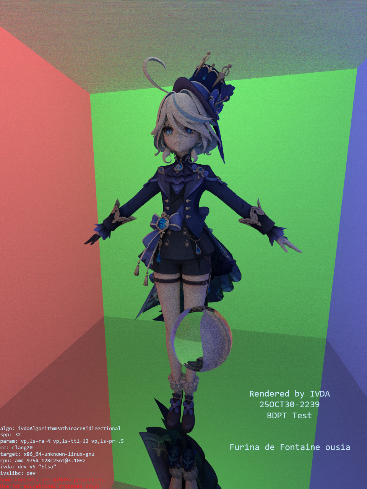

# Project IVDA

*"Invisparent's Digital Arts Project" (Under Development)*

## Compatibility
ivda is written in **C11/C17**, with several widely-accepted language extensions and POSIX.1-2008 APIs. It is expected to be cross-platform and should work on most compilers (e.g. GCC 4.9+ or Clang).

## Project Structure
*   Source files (`.c`) are located in the `./src` folder.
*   Header files (`.h`) are located in the `./include` folder.

## Build
ivda uses CMake for building. It requires libivs. You should set CMake variable IVS_ROOT to the path to libivs. You can also build it manually if needed.

## License
ivda is published under the [GNU Lesser General Public License v3.0](https://www.gnu.org/licenses/lgpl-3.0.html).

## Current Status & Refactoring
This image was rendered using the legacy version of ivda, which has been completely refactored:

**Why refactor?**
The initial implementation suffered from significant architectural debt. Mixing complex logic in pure C without proper abstraction led to a codebase exceeding 15k lines, making it difficult to maintain and extend.

To address this, ivda was rewritten several months ago with the following goals: **elegance, robustness, and performance.**

**New Features:**
*  🌈 **Spectrum Rendering** support.
*  ⚡ **Optimized BVH Acceleration Structure** (Cache-friendly design).
*  👁️ **Color Management**: CIE-1931 Support included.
*  🎲 **Enhanced Multiple Importance Sampling (MIS)**.
*  🔧 **POSIX Threads (`<pthread.h>`)**: Chosen over `<threads.h>` for broader compatibility.
*  🏗️ **Improved Architectural Design** for better modularity.
*  ✨ And More...

## ⚠️ DISCLAIMER
* **CURRENTLY, THIS PROJECT IS IN EARLY DEVELOPMENT STAGE.**
* **ITS API (INCLUDING MEMORY LAYOUT) MAY CHANGE AT ANY TIME WITHOUT NOTICE.**
